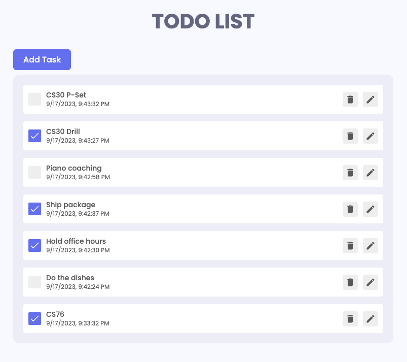

# Hack-a-Thing 1: Todo List

## What you built? 
A simplistic todo list built using React, Redux, and Framer Motion.
Supports the following functionality:
- Mark tasks as done or uncheck them
- Records timestamp of each task creation
- Menu for each task that allows renaming and changing task status
- Deleting tasks

## Who Did What?
I worked alone so I did the whole thing.

## What you learned
Through building this simple todo list, I was able to get more comfortable with React. I had never worked with it before and thought I would learn it now since it's so important in web development. I found implementing most of the logic behind the todo list to be manageable, and most of the time was reading documentation and figuring out what functions were avaliable to me. What I found particularly challenging and time-consuming was getting Redux set up to store data inputted by the user. It was also took me a while to understand how it connects to the local storage / general infrastructure of the app.

## Authors
Stephen Wang

## Acknowledgments
- https://www.youtube.com/watch?v=W0Uf_xu350k
- https://www.youtube.com/watch?v=O6P86uwfdR0
- https://yosracodes.hashnode.dev/creating-a-to-do-list-app-using-redux-toolkit
